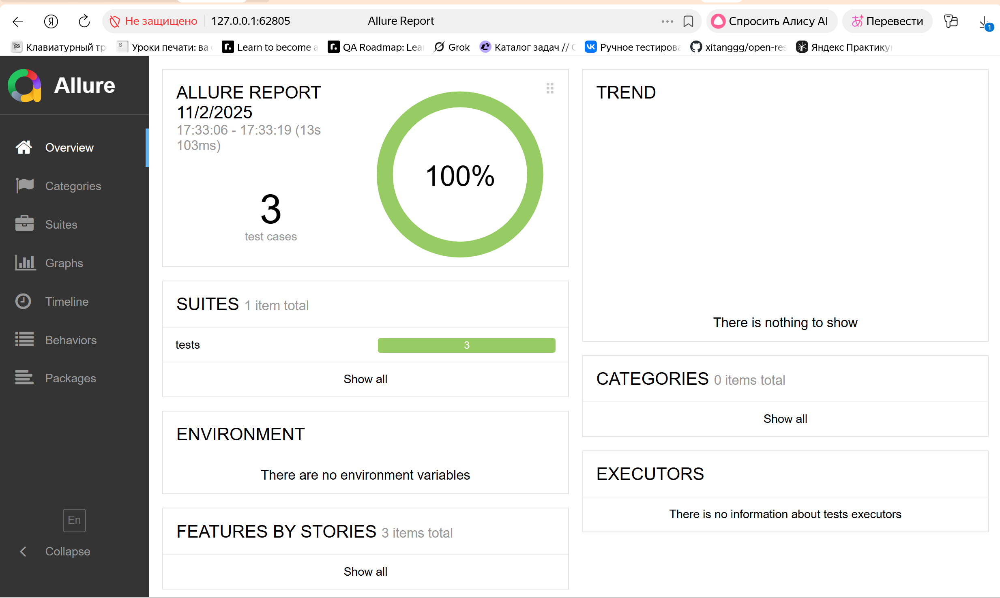

# Banking-ui-autotests
### Test Case 1

1. **Идентификатор (ID):**
    - TC_001

2. **Название (Title):**
    - Добавление нового клиента (Add Сustomer)

3. **Описание (Description):**
    - Проверка возможности добавления нового клиента через форму "Add Customer" с автоматической генерацией Post Code и First Name по заданному алгоритму.

4. **Предусловия (Preconditions):**
    - Открыта страница [BankingProject Manager](https://www.globalsqa.com/angularJs-protractor/BankingProject/#/manager)
    - Пользователь находится на вкладке "Add Customer"

5. **Шаги (Steps):**
    1. Сгенерировать Post Code — строка из 10 случайных цифр (например, 1234567890)
    2. Сгенерировать First Name по алгоритму:
        - Разбить Post Code на 5 пар цифр (например, 12, 34, 56, 78, 90)
        - Каждую пару перевести в число и взять остаток от деления на 26 (`число % 26`)
        - Преобразовать каждое число в букву английского алфавита: 0 = 'a', 1 = 'b', ..., 25 = 'z'
        - Соединить буквы в строку (например, "mieam")
    3. Ввести First Name (сгенерированное), Last Name (такое же, как и First Name), Post Code (сгенерированный)
    4. Нажать кнопку "Add Customer"
    5. Подтвердить появившееся всплывающее сообщение (alert) о добавлении клиента и закрыть его

6. **Ожидаемый результат (Expected Result):**
    - В таблице "Customers" появляется новая запись с указанными First Name, Last Name и Post Code.
    - Система не показывает ошибок.
    - Появляется alert с сообщением об успешном добавлении клиента.

7. **Фактический результат (Actual Result):**
    - Новый клиент успешно добавляется.
    - Alert с сообщением об успешном добавлении отображается и закрывается.
    - Запись с указанными First Name, Last Name и Post Code появляется в таблице "Customers".
    - Ошибок не возникает.

8. **Статус (Status):**
    - Пройден

9. **Приоритет (Priority):**
    - Высокий

### Test Case 2

1. **Идентификатор (ID):**
    - TC_002

2. **Название (Title):**
    - Сортировка клиентов по имени (First Name)

3. **Описание (Description):**
    - Проверить, что после нажатия на заголовок столбца "First Name" в таблице клиентов происходит корректная сортировка записей по алфавиту (A→Z) и по убыванию (Z→A)

4. **Предусловия (Preconditions):**
    - Открыта страница [BankingProject Manager](https://www.globalsqa.com/angularJs-protractor/BankingProject/#/manager)
    - На вкладке "Customers" есть не менее 3 клиентов с разными значениями First Name

5. **Шаги (Steps):**
    1. Перейти на вкладку "Customers".
    2. Считать и сохранить список всех First Name из таблицы клиентов, как они отображаются до сортировки.
    3. Кликнуть по заголовку столбца "First Name" один раз.
    4. Считать и сохранить новый порядок First Name в таблице.
    5. Проверить, что список First Name теперь отсортирован по убыванию (Z→A).
    6. Кликнуть по заголовку "First Name" ещё раз.
    7. Считать и сохранить новый порядок First Name.
    8. Проверить, что список First Name теперь отсортирован по возрастанию (A→Z).

6. **Ожидаемый результат (Expected Result):**
    - После первого клика по заголовку "First Name" записи сортируются по убыванию (Z→A).
    - После второго клика — по возрастанию (A→Z).

7. **Фактический результат (Actual Result):**
    - После первого клика по заголовку "First Name" имена сортируются по убыванию (Z→A).
    - После второго клика по заголовку "First Name" имена сортируются по возрастанию (A→Z).
    - Ошибок не возникает

8. **Статус (Status):**
    - Пройден

9. **Приоритет (Priority):**
    - Средний

### Test Case 3

1. **Идентификатор (ID):**
    - TC_003

2. **Название (Title):**
    - Удаление клиента

3. **Описание (Description):**
    - Проверить, что на вкладке "Customers" можно удалить клиента, имя которого по длине ближе всего к среднему арифметическому длин всех имён в таблице.

4. **Предусловия (Preconditions):**
    - Открыта страница [BankingProject Manager](https://www.globalsqa.com/angularJs-protractor/BankingProject/#/manager)
    - На вкладке "Customers" есть хотя бы 3 клиента с разными именами

5. **Шаги (Steps):**
    1. Перейти на вкладку "Customers".
    2. Получить список всех имён (First Name) клиентов из таблицы.
    3. Для каждого имени вычислить длину имени.
    4. Посчитать среднее арифметическое всех длин имён.
    5. Найти имя, длина которого минимально отличается от среднего арифметического.
    6. Найти строку в таблице с этим именем и нажать кнопку "Delete" для этой строки.
    7. Обновить список имён из таблицы.
    8. Убедиться, что клиента с этим именем больше нет в таблице.
    
6. **Ожидаемый результат (Expected Result):**
    - Клиент с именем, длина которого ближе всего к среднему арифметическому, удаляется из таблицы, и его имя отсутствует среди оставшихся клиентов.

7. **Фактический результат (Actual Result):**
    - Клиент с именем, длина которого ближе всего к среднему арифметическому, успешно удаляется.
    - После обновления таблицы этого имени больше нет среди клиентов.
    - Ошибок не возникает

8. **Статус (Status):**
    - Пройден

9. **Приоритет (Priority):**
    - Средний

### Allure-отчёт

